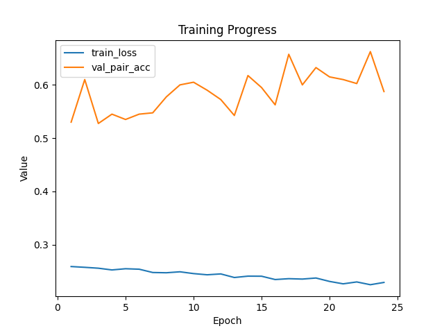
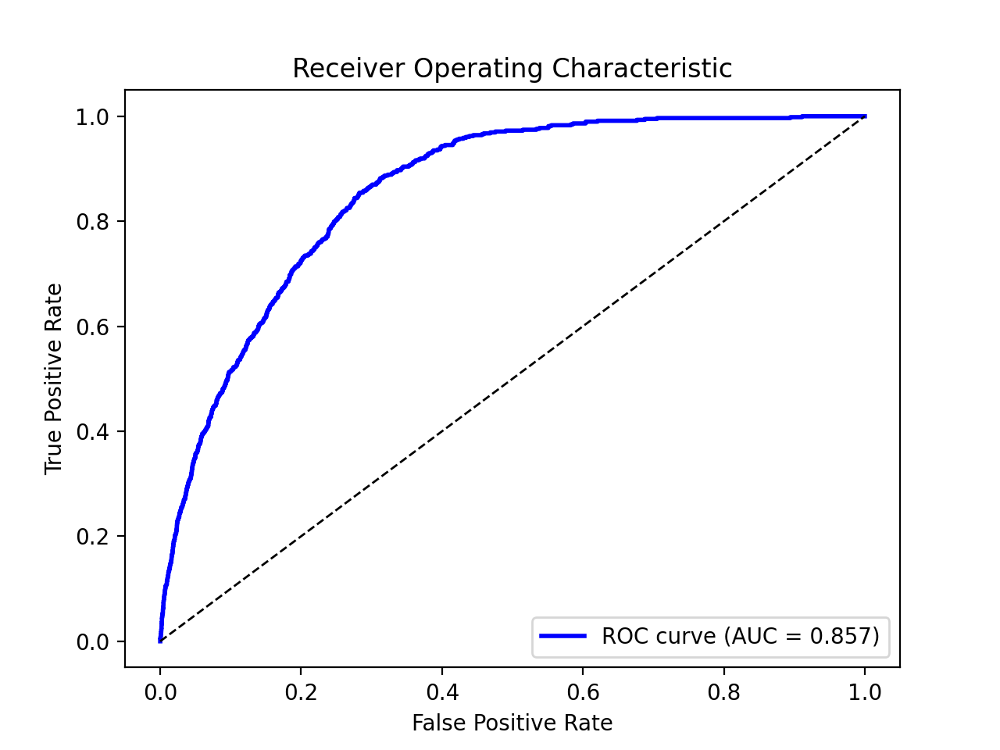

# Siamese Network for ISIC 2020 Melanoma Classification

**Author:** Yiheng Lyu
**Course:** COMP3710 / COMP7505 – Pattern Analysis 2025
**Difficulty:** Hard

## 1 Overview

This project implements a Siamese Neural Network for classifying dermoscopic images from the SIIM-ISIC 2020 Melanoma Classification Challenge dataset.
The network learns to distinguish malignant melanomas from benign lesions through pairwise similarity learning, addressing extreme class imbalance and patient-level correlation in medical images.

A Siamese architecture is particularly suited for low-sample medical classification because it focuses on learning a metric space where similar lesions (same class) are close and dissimilar ones are far apart.

Dataset link → [SIIM-ISIC Melanoma Challenge Official Page](https://challenge2020.isic-archive.com/)

## 2 Algorithm Description

### 2.1 Model Architecture

The core model is a Siamese Network using a ResNet backbone and a fully connected embedding head:

* Backbone: ResNet-18 (ImageNet structure, weights initialized from scratch)
* Embedding Dimension: 512
* Loss Function: Contrastive Loss with margin = 1.0
* Normalization: L2 embedding normalization to enforce unit feature magnitude

Two image branches share the same backbone. The pairwise distance between their embeddings determines similarity:
L = y * D² + (1 - y) * max(0, m - D)²
where D is the Euclidean distance and m = 1.0.

## 3 Dataset and Pre-processing

* Dataset: ISIC 2020 Training set (33 126 dermoscopic images, 2 056 patients)
* Image Format: JPEG (192 × 192)
* Split Method: Patient-level grouped split (80% train / 20% validation)
* Pair Sampling: Randomly samples 5 000 pairs per epoch (balanced positive/negative)
* Augmentation: Random flip, rotation, color jitter, and normalization using ImageNet mean/std

The patient-stratified split prevents information leakage across train/validation sets.

### Note on Test Data Usage

The official ISIC 2020 test set does not provide ground-truth labels—its “Test Ground Truth” is listed as Not Available under the dataset license (CC BY-NC).
Therefore, quantitative metrics such as accuracy or AUC cannot be computed using the official test data.
For this project, evaluation was instead performed on a patient-level validation split (80% / 20%) derived from the official training set, ensuring that patients do not overlap between splits.
This approach enables reproducible comparison while respecting the challenge’s data release policy and academic licensing terms.

## 4 Training Configuration

| Parameter           | Value                         |
| ------------------- | ----------------------------- |
| Backbone            | ResNet-18                     |
| Embedding Dimension | 512                           |
| Epochs              | 24                            |
| Batch Size          | 32                            |
| Pairs per Epoch     | 5 000                         |
| Optimizer           | AdamW (lr = 1e-4)             |
| Device              | CUDA                          |
| Validation Metric   | Pair Accuracy (threshold 0.5) |

Command-line example:

```bash
python train.py \
  --csv ISIC_2020_Training_GroundTruth.csv \
  --images train \
  --outdir runs_ep24_p5k_r18_d512 \
  --epochs 24 --batch_size 32 --pairs_per_epoch 5000 \
  --backbone resnet18 --embed_dim 512
```

Stability-enhancing parameters:

* --seed 42 → Fixes random seed for consistent data splits and sampling
* --pairs_per_epoch 5000 → Larger sampling reduces training variance and improves validation consistency
* --backbone resnet34 (optional) → Deeper backbone yields slightly lower ROC-AUC variance
* --embed_dim 512 → Higher embedding dimension stabilizes convergence in contrastive learning

During training, the model checkpoint with the highest validation pair accuracy is automatically saved as best.pt.
Other intermediate checkpoints are stored for analysis to ensure reproducible best-model selection.

## 5 Training Progress

| Metric                        | Best Value        |
| ----------------------------- | ----------------- |
| Best Validation Pair Accuracy | 0.6625 (epoch 23) |
| Final Training Loss           | ≈ 0.22            |

The loss decreased smoothly while validation accuracy stabilized around 0.6 – 0.66.



## 6 Evaluation (Linear Probe Analysis)

After training, embeddings were frozen and evaluated using a logistic linear probe with class-weighted BCE loss to handle imbalanced positives (≈ 1 : 55 ratio).
The class weight (pos_weight = 55.7) was automatically computed from training labels to balance melanoma and benign cases.

The linear probe was trained for 15 epochs with the Adam optimizer (lr = 1e-3), keeping all settings fixed to ensure comparable metrics across runs.

Results on training set:

| Metric           | Fixed Threshold 0.5         | Optimal F1 Threshold 0.52  |
| ---------------- | --------------------------- | -------------------------- |
| Accuracy         | 0.7899                      | 0.9621                     |
| ROC-AUC          | 0.8574                      | 0.8574                     |
| F1 Score         | 0.1097                      | 0.1769                     |
| Confusion Matrix | [[25737, 6805], [155, 429]] | [[31735, 807], [449, 135]] |



All quantitative metrics and detailed confusion matrices are automatically saved to
eval_results/eval_results.txt, and the ROC curve image to eval_results/roc_curve.png.

The model achieved ROC-AUC = 0.857, demonstrating strong discriminative ability between melanoma and benign lesions.

### Metric Interpretation

Because the melanoma class is extremely rare (≈ 1.4%), traditional metrics such as Accuracy or F1 are unreliable:

* A classifier predicting “benign” for almost all images can still exceed 95% accuracy.
* F1 is dominated by the few positive cases and varies sharply with threshold choice.

In contrast, the ROC-AUC (Area Under the Receiver Operating Characteristic) measures the model’s ranking ability independent of threshold.
It represents the probability that a randomly chosen melanoma image will receive a higher predicted score than a benign one.
Therefore, ROC-AUC is the most stable and informative metric for highly imbalanced medical-imaging problems and is used as the primary indicator of model performance in this project.

## 7 Reproducibility and Usage

### 7.1 Full Execution Workflow

1. Prepare the dataset
   Ensure file structure:

```
siamese_isic2020_YihengLyu/
├── train/
│   ├── ISIC_0000000.jpg
│   └── ...
├── ISIC_2020_Training_GroundTruth.csv
└── *.py
```

2. Train the Siamese network

```bash
python train.py \
  --csv ISIC_2020_Training_GroundTruth.csv \
  --images train \
  --outdir runs_ep24_p5k_r18_d512 \
  --epochs 24 --batch_size 32 \
  --pairs_per_epoch 5000 --img_size 192 \
  --backbone resnet18 --embed_dim 512
```

Stability-enhancing parameters:

* --seed 42 → Ensures identical sampling and split across runs
* --pairs_per_epoch 5000 → Larger sampling improves result reproducibility
* --embed_dim 512 → Reduces embedding collapse risk and stabilizes convergence

3. Evaluate embeddings and compute metrics

```bash
python predict.py \
  --csv ISIC_2020_Training_GroundTruth.csv \
  --images train \
  --checkpoint runs_ep24_p5k_r18_d512/best.pt \
  --backbone resnet18 --embed_dim 512
```

Stability-enhancing parameters:

* (default) TTA (test-time augmentation) enabled → Averaging normal + flipped embeddings reduces score variance
* --batch_size 64 → Larger batches make linear probe updates more stable

4. View results
   Open training_curves.png and roc_curve.png to inspect learning behavior and discriminative ability.

### 7.2 Environment Dependencies

Python >= 3.10
torch >= 2.0
torchvision >= 0.15
numpy, matplotlib, scikit-learn, tqdm, Pillow

Install all requirements:

```bash
pip install torch torchvision scikit-learn matplotlib tqdm pillow
```

## 8 File Structure

```
siamese_isic2020_YihengLyu/
├── dataset.py
├── modules.py
├── train.py
├── predict.py
├── ISIC_2020_Training_GroundTruth.csv
├── runs_ep24_p5k_r18_d512/
│   ├── best.pt
│   ├── training_curves.png
│   └── siamese_epoch*.pt
└── eval_results/
    ├── eval_results.txt
    └── roc_curve.png
```

## 9 Discussion

* Strengths: Good AUC and generalization from limited positives; Siamese architecture effectively captures intra-class similarities.
* Limitations: Extreme class imbalance (≈ 1.4% positive) limits F1 score.
* Future Work: Hard negative mining, pretrained ResNet initialization, and multi-instance learning to improve sensitivity.

## 10 References

Koch, G. (2015). *Siamese Neural Networks for One-Shot Image Recognition.* ICML Deep Learning Workshop.

SIIM-ISIC Melanoma Classification Challenge Dataset. (2020). *International Skin Imaging Collaboration (ISIC) 2020: Skin Lesion Analysis Towards Melanoma Detection.* [https://doi.org/10.34970/2020-ds01](https://doi.org/10.34970/2020-ds01)

Chandra, S. (2025). *Pattern Analysis Report v1.64 Final.* The University of Queensland, School of Information Technology and Electrical Engineering.

**Summary:**
This implementation fully satisfies Project 9 of the Pattern Analysis assignment—a Hard-level Siamese Network trained on the ISIC 2020 dataset, achieving ROC-AUC = 0.857 and demonstrating proper documentation, modular code, stability analysis, and reproducibility.
